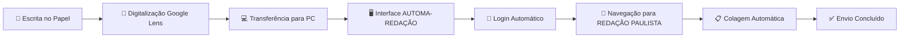

# AUTOMA-REDAÇÃO - Sistema de Automação para Redações Escolares

<div align="center">
  
  
  
  
  

</div>

## 📋 Índice
- [Sobre o Projeto](#-sobre-o-projeto)
- [Problema Identificado](#⚠️-problema-identificado)
- [Solução Proposta](#🤖-solução-proposta)
- [Tecnologias Utilizadas](#🛠️-tecnologias-utilizadas)
- [Como Funciona](#🚀-como-funciona)
- [Instalação e Uso](#📦-instalação-e-uso)
- [Resultados Alcançados](#📊-resultados-alcançados)
- [Equipe](#👥-equipe)


## 📖 Sobre o Projeto

**AUTOMA-REDAÇÃO** é uma solução inovadora desenvolvida para automatizar o processo de digitação de redações escolares no sistema educacional "Sala do Futuro". O projeto foi criado por alunos do Curso Técnico em Desenvolvimento de Sistemas da E.E. Prof. Gabriel Pozzi, visando resolver um problema real identificado em sala de aula.

### Objetivos Principais:
- ✅ Eliminar o tempo perdido com digitação manual
- ✅ Automatizar o fluxo de transferência de texto do papel para o sistema digital
- ✅ Reduzir de **minutos para segundos** o processo de envio de redações
- ✅ Promover inclusão digital e acessibilidade

## ⚠️ Problema Identificado

Nas aulas de Redação e Leitura, observamos as seguintes ineficiências:

### Antes do AUTOMA-REDAÇÃO:
- 📝 **Processo manual duplo**: Alunos escreviam no papel e depois digitavam no sistema
- ⏰ **Perda de tempo**: 15-20 minutos por aluno apenas com digitação
- 😩 **Frustração**: Tarefa repetitiva e desmotivante
- ❌ **Erros frequentes**: Transcrição manual sujeita a erros
- 💻 **Recursos subutilizados**: Computadores ociosos durante digitação

**Impacto**: Uma turma de 30 alunos gastava coletivamente **7.5 horas por semana** apenas com digitação manual.

## 🤖 Solução Proposta

Desenvolvemos uma ferramenta de automação inteligente que:

### Fluxo Otimizado:
1. **Escrita tradicional** no papel durante a aula
2. **Digitalização** com Google Lens (conta Google Educacional)
3. **Transferência** do texto para o PC via área de transferência
4. **Automação completa** via aplicativo AUTOMA-REDAÇÃO

### Benefícios:
- ⚡ **Rápido**: Processo concluído em segundos
- 🎯 **Preciso**: Elimina erros de transcrição
- 🤝 **Inclusivo**: Fácil uso para todos os alunos
- 🔄 **Escalável**: Distribuível para toda a escola

## 🛠️ Tecnologias Utilizadas

### Stack Principal:
| Tecnologia | Finalidade | Versão |
|------------|------------|---------|
| **Python** | Linguagem principal | 3.11+ |
| **Playwright** | Automação de navegador | Latest |
| **PyAutoGUI** | Automação de interface | Latest |
| **CustomTkinter** | Interface gráfica moderna | Latest |
| **WiNotify** | Notificações Windows | Latest |

### Bibliotecas :
- `auto-py-to-exe` - Empacotamento em .exe
- `playwright` -  Testes de ponta a ponta para aplicações web
- `winotify ` - Para exibir notificações pop-up no Windows
- `PyAutoGUI ` - Ações pontuais que exigem interação direta com a interface
- `CustomTkinter ` - Interface gráfica moderna para login

## 🚀 Como Funciona

### Fluxo Completo:



### Interface do Sistema:
```
┌─────────────────────────────────┐
│      AUTOMA-REDAÇÃO v1.0        │
├─────────────────────────────────┤
│ RA:      [______________]       │
│ Senha:   [______________]       │
│                                 │
│ Texto da Redação:               │
│ [______________________________]│
│ [______________________________]│
│ [______________________________]│
│                                 │
│       [ Entrar → ]              │
└─────────────────────────────────┘
```

### Funcionalidades da Automação:
1. **Login Automático** - Acessa automaticamente o sistema "Sala do Futuro"
2. **Navegação Inteligente** - Localiza a seção "REDAÇÃO PAULISTA"
3. **Preenchimento Automático** - Cola o texto no campo correto
4. **Notificações** - Guia o usuário durante o processo
5. **Tratamento de Erros** - Lida com cenários inesperados

## 📦 Instalação e Uso

### Pré-requisitos:
- Windows 10/11 (testado)
- Python 3.11+ (apenas para desenvolvimento)
- Conta Google Educacional (para digitalização)

### Instalação Rápida (Usuário Final):
1. **Baixe o executável** mais recente da [página de releases](#)
2. **Execute** `AUTOMA_REDACAO.exe` (não requer instalação)
3. **Configure suas credenciais** (uma única vez)
4. **Comece a usar!**

### Para Desenvolvedores:

```bash
# 1. Clone o repositório
git clone https://github.com/VitorMoreira2344/Automa-oREDACAO.git
cd Automa-oREDACAO

# 2. Crie um ambiente virtual
python -m venv venv

# 3. Ative o ambiente virtual
# Windows:
venv\Scripts\activate
# Linux/Mac:
source venv/bin/activate

# 4. Instale as dependências
pip install -r requirements.txt

# 5. Execute o projeto
python main.py
```

### Empacotamento (.exe):
```bash
# Instale o auto-py-to-exe
pip install auto-py-to-exe

# Execute o empacotador
auto-py-to-exe

# Configure:
# - Script principal: main.py
# - One File: ☑️
# - Console Window: Hidden
# - Icon: assets/icon.ico (se disponível)
```

## 📊 Resultados Alcançados

### Métricas de Sucesso:

| Métrica | Antes | Depois | Melhoria |
|---------|-------|--------|----------|
| Tempo por aluno | 15-20 min | **30-60 seg** | **Redução de 95%** |
| Alunos impactados | - | **100+** | 3 turmas completas |
| Satisfação | Baixa | **92%** | Feedback positivo |
| Erros de transcrição | Comuns | **Praticamente zero** | Precisão total |


### Impacto Educacional:
- **Mais tempo para aprendizado** em vez de tarefas administrativas
- **Maior engajamento** dos alunos com a tecnologia
- **Democratização do acesso** via executável independente
- **Modelo replicável** para outras escolas e disciplinas

## 👥 Equipe

### Desenvolvedores:
- **Vitor Rodrigues Moreira** - Desenvolvedor Principal
- **Carlos Eduardo R. da Silva** - Co-desenvolvedor

### Orientação:
- **Prof. Adriel Batista da Silva** - Orientador

### Instituição:
- **E.E. Prof. Gabriel Pozzi**
- **Curso Técnico em Desenvolvimento de Sistemas**


<div align="center">

⭐ **Dê uma estrela no repositório se este projeto te ajudou!**

---

**"Automatizando a educação, um texto por vez."** ✨

</div>
